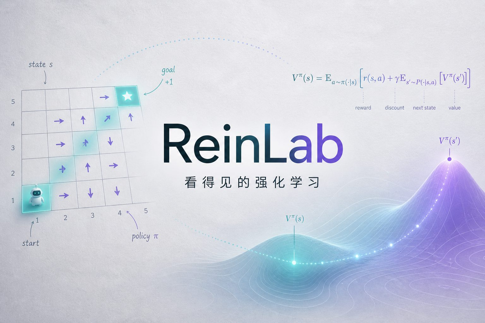
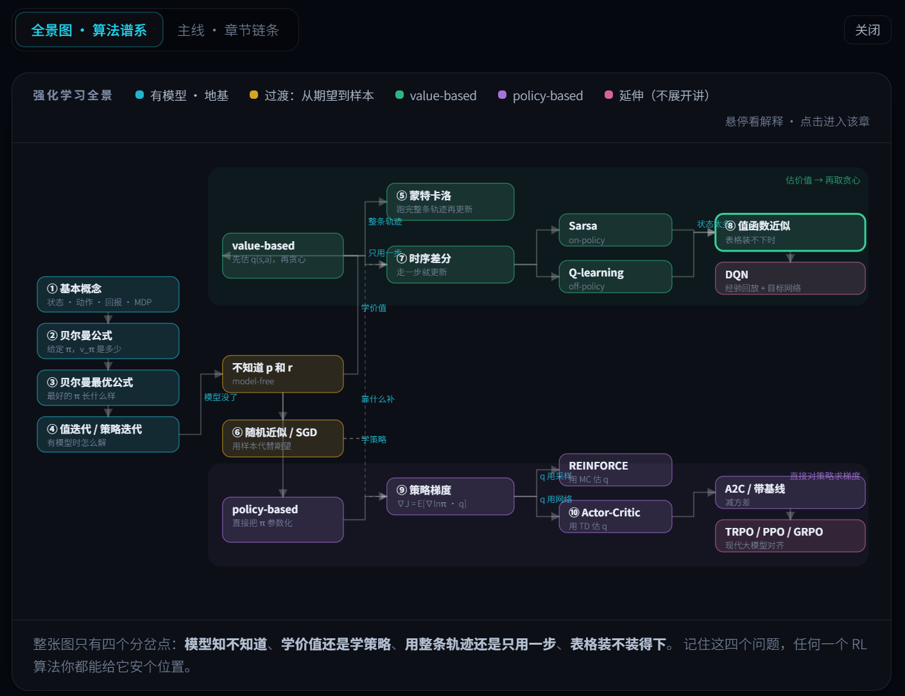

<p align="center">
  
</p>

<p align="center">
  <strong>ReinLab</strong> · 看得见的强化学习<br/>
  <em>把公式演出来。从贝尔曼方程一路走到 Actor-Critic。</em>
</p>

<p align="center">
  <a href="#快速开始"></a>
  <a href="#十章课程"></a>
  <a href="#内容正确性"></a>
  <a href="#技术栈"></a>
  <a href="LICENSE"></a>
</p>

<p align="center">
  <a href="#快速开始"><b>本地运行</b></a> ·
  <a href="#它赢在哪里"><b>设计理念</b></a> ·
  <a href="#十章课程"><b>课程地图</b></a> ·
  <a href="#架构"><b>架构</b></a>
</p>

---

## 这是什么

**ReinLab**（Reinforcement Learning + Lab）是一套**可交互**的强化学习教程。

不是视频课的文字版，也不是又一份「抄一遍伪代码」的笔记。它要解决的是学 RL 时最痛的三件事：

| 痛点 | ReinLab 怎么做 |
| --- | --- |
| 符号对不上画面 | **活的公式**：鼠标放到公式任意一段，网格世界里对应的格子 / 箭头同步高亮；点格子，公式围绕它展开 |
| 算法内部是黑箱 | **时间轴 + 调试器**：值迭代、策略迭代、MC / TD / PG 都能一帧一帧 scrub |
| 读懂了却记不住 | **先下注再揭晓**：核心概念前必须先做预测；速读模式可只留要点与公式 |

主线对齐《强化学习的数学原理》（赵世钰）：从基本概念一路走到 Actor-Critic，**十章全部可交互**。

<p align="center">
  
</p>
<p align="center">
  <sub>把鼠标放到公式任意一段上，网格里对应的格子 / 箭头会同步亮起；拖动 γ，整个价值场当场重排。</sub>
</p>

---

## 它赢在哪里

高质量 B 站课和博客赢在「讲清楚」。ReinLab 想多赢一层：**让你亲手拧旋钮，看见世界改口。**

1. **公式、图、数值同屏且双向绑定**  
   依据：认知负荷理论的注意力分散效应（split-attention）。对应关系不该靠你脑内对齐。

2. **先下注，再揭晓**  
   依据：生成效应 / productive failure。猜错被纠正的那一刻，记得最牢。

3. **按认知顺序，不按逻辑顺序**  
   教材是「定义 → 定理 → 证明」；这里是「困惑 → 笨办法 → 失败 → 修正 → 原理」。

4. **直觉与数学都不打折**  
   一句话直觉 + 可展开推导 + 可运行伪代码。深度你控制，严谨性不缩水。

5. **注意力按幕切分**  
   每章切成 8–12 分钟的「幕」，章首有一页纸速览，顶栏可开**速读模式**。

---

## 十章课程

| # | 章节 | 你带走什么 |
| -: | --- | --- |
| 1 | 基本概念 | 状态、动作、策略、回报、MDP —— 和画面上的一一对应 |
| 2 | 贝尔曼公式 | \(v_\pi = r_\pi + \gamma P_\pi v_\pi\)，以及为什么一定有解 |
| 3 | 贝尔曼最优公式 | 加一个 \(\max\)：最优存在、唯一，且可以是确定性的 |
| 4 | 值迭代与策略迭代 | 截断谱系滑块：两者是同一条连续谱的两端 |
| 5 | 蒙特卡洛 | 用采样代替期望；ε 的代价与 exploring starts |
| 6 | 随机近似与 SGD | Robbins–Monro 条件；BGD / MBGD / SGD 殊途同归 |
| 7 | 时序差分 | Sarsa vs Q-learning 悬崖对决：学到的最优 ≠ 在线走得最好 |
| 8 | 值函数近似 | 半梯度 TD；致命三位一体开关（Baird 反例） |
| 9 | 策略梯度 | Softmax 策略 + REINFORCE；基线如何降方差 |
| 10 | Actor-Critic | REINFORCE / 基线 / QAC / A2C 同台对照 |

每一章都在偿还上一章留下的债 —— 打开地图抽屉，随时知道「我在哪、为什么在这」。

<p align="center">
  
</p>
<p align="center">
  <sub>全景图把全书算法按「有模型 / 无模型 → 价值 / 策略 → 轨迹 / 单步 → 表格 / 近似」四次分岔摊开。悬停看解释，点击进对应章节。</sub>
</p>

---

## 快速开始

```bash
git clone https://github.com/YOUR_USERNAME/ReinLab.git
cd ReinLab
npm install
npm run dev        # → http://localhost:5173
```

> 把 `YOUR_USERNAME` 换成你的 GitHub 用户名。若仓库名不同，同步改路径即可。

常用命令：

```bash
npm run build      # 类型检查 + 生产构建
npm run typecheck  # 只做类型检查
npm run verify     # 数值 / KaTeX / 主题 / 核心断言
npm run check      # typecheck + verify + build（提交前跑这个）
```

> 部署：任意静态托管即可（Vercel / Netlify / GitHub Pages）。构建产物在 `dist/`。

---

## 架构

```
src/
  core/            纯计算内核（不依赖 React）
    mdp.ts         MDP、经典网格 / 悬崖 / 蛇形走廊
    solvers.ts     策略评估、值迭代、截断策略迭代
    env.ts         采样式 Env —— model-free 的分界线
    learn.ts       MC / Sarsa / Q-learning / n-step
    approx.ts      Robbins-Monro、SGD 三兄弟
    fa.ts          特征映射、半梯度 TD、Baird
    pg.ts          REINFORCE、QAC、A2C
  formula/         公式 = 带语义的表达式树（渲染 / 求值 / 高亮三合一）
  highlight/       语义高亮总线
  viz/             GridWorld · LineChart · MatrixHeatmap
  narrative/       Act/Beat · Predict · FrameworkMap · Storyline
  chapters/        十章内容（路由懒加载）
```

### 为什么公式是一棵树，而不是一个字符串

常见做法是「LaTeX 字符串丢给 KaTeX + 另写一份计算」。那条路做不到：

- 把符号替换成**真实数值**逐层展开；
- 让公式片段与世界视图**双向绑定**（渲染结果是匿名 DOM）。

所以 `FNode` 同时具备：`render` → KaTeX（带 `htmlId`）、`value` → 求值、`entities` → 声明它指向世界里的什么。高亮总线上流动的是一小撮语义实体（`state` / `action` / `reward` / `value` / …），加新视图是零成本接入。

---

## 内容正确性

页面上的数字都是**当场算出来的**。此外有四道自动化校验：

| 脚本 | 查什么 |
| --- | --- |
| `scripts/verify.mjs` | 第 1–3 章：独立重写算法做交叉验证 |
| `scripts/verify-katex.mjs` | 公式可渲染；`\htmlId` 在 aligned / 中文下不失效 |
| `scripts/verify-theme.mjs` | 浅色 / 深色令牌对称；禁止绕过变量写死颜色 |
| `scripts/verify-core.ts` | 第 4–10 章：**40 条定性断言**（用正文同款实现与种子） |

例如第 4 章「截断谱系」若跑在经典 5×5 上会几乎是一条直线——校验脚本会抓到这件事；正文因此改用蛇形走廊，曲线变成「先陡后平」，并压在策略迭代的地板上。

改内容或超参后请跑：

```bash
npm run check
```

---

## 技术栈

- **React 19** · **TypeScript 7** · **Vite 8** · **Tailwind CSS 4**
- **Framer Motion**（动效）· **KaTeX**（公式）· **Zustand**（状态）
- 算法内核全部 TypeScript 实现，交互反馈压在 100ms 量级
- 浅色默认（灰纸底护眼）+ 深色可切换，颜色全部走语义 CSS 变量

---

## 路线图

- [x] 十章完整交互内容  
- [x] 活的公式双向绑定  
- [x] 章首速览 + 速读模式 + 全局思维导图  
- [x] 数值 / 主题 / KaTeX 自动化校验  
- [x] README 真实界面截图  
- [ ] 英文版文案  
- [ ] 交互演示 GIF  
- [ ] Pyodide 嵌入，让读者改真 Python  

---

## 贡献

欢迎 Issue / PR。改算法或正文断言时，请附上 `npm run check` 通过的结果。

若你用 ReinLab 上课或做分享，开 Issue 告诉我们——很想知道它在教室里表现如何。

---

## 致谢

- 主线参考：[赵世钰《强化学习的数学原理》](https://github.com/MathFoundationRL/Book-Mathematical-Foundation-of-Reinforcement-Learning)  
- 悬崖行走等经典设定来自 Sutton & Barto  
- 交互叙事灵感：3Blue1Brown · Desmos · Red Blob Games · Explorable Explanations  

---

## License

[MIT](LICENSE)

---

<p align="center">
  <sub>ReinLab — Reinforcement Learning, made visible.</sub><br/>
  <sub>如果它对你有帮助，请点一颗 ⭐ —— 这是让更多人看见它的最短路径。</sub>
</p>
